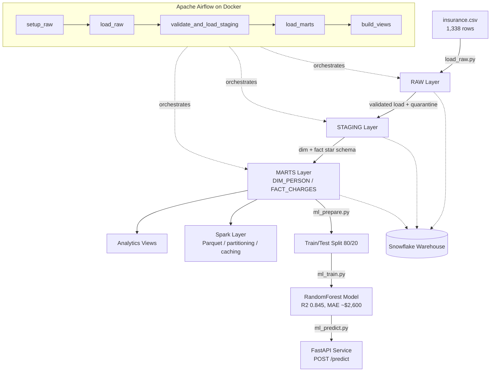

# Healthcare Claims Intelligence Platform

An end-to-end data engineering platform that ingests healthcare insurance data,
processes it through a layered **medallion architecture**, serves analytics-ready
insights via a dimensional **star schema** on Snowflake, and extends into
**big-data processing (Spark)**, **workflow orchestration (Airflow)**, and a
**machine-learning model served over a REST API (FastAPI)**.

Built with Python and Snowflake, orchestrated in Docker, fully version-controlled.

---

## Architecture

| Layer | Purpose |
|-------|---------|
| **RAW** | Immutable, exact copy of source data with audit timestamps. Never modified. |
| **STAGING** | Cleaned, standardized, deduplicated. Idempotent truncate-and-load. Bad rows quarantined. |
| **MARTS** | Dimensional star schema (`FACT_CHARGES` + `DIM_PERSON`) modeled for analytics. |
| **VIEWS** | Business-ready analytics — region cost, smoker risk, age-band analysis. |

---

## Platform Layers

### 1. Medallion ETL Pipeline (Snowflake)
RAW -> STAGING -> MARTS -> Views, idempotent and validated. Bad records are
routed to a quarantine table rather than failing the load.

### 2. Spark Processing Layer
PySpark transformations demonstrating Parquet I/O, partitioning, predicate
pushdown / partition pruning (proven via `.explain()`), and caching.

### 3. Orchestration (Apache Airflow on Docker)
The full pipeline runs as an Airflow DAG (`healthcare_pipeline`) on a
containerized CeleryExecutor stack (Postgres + Redis + workers). Five
BashOperators execute the real pipeline scripts against Snowflake with
retries and explicit task dependencies.

### 4. Machine Learning Layer
A RandomForest regressor predicts insurance charges from person attributes.
- Pulled from the MARTS star schema (dim + fact join), one-hot encoded, 80/20 split
- **R2 = 0.845, MAE = ~$2,600** on a held-out test set
- Feature importance: **smoker (0.62)**, bmi (0.21), age (0.13) dominate

### 5. Model Serving (FastAPI)
The trained model is served as a REST API.
- `POST /predict` — validated (Pydantic) attributes in, predicted charge as JSON out
- `GET /health` — liveness check
- Auto-generated OpenAPI docs at `/docs`

Example: same person, smoker `$32,160` vs non-smoker `$8,463` — a ~$24k swing.

---

## Tech Stack
- **Warehouse:** Snowflake
- **Processing:** PySpark
- **Orchestration:** Apache Airflow 2.10.3 (Docker Compose, CeleryExecutor)
- **ML:** scikit-learn (RandomForest), joblib
- **Serving:** FastAPI + Uvicorn + Pydantic
- **Language:** Python 3.x
- **Version control:** Git / GitHub

---

## Key Engineering Concepts Demonstrated
- Medallion architecture with strict layer separation
- Idempotent loading (truncate-and-load) — safe to re-run on a schedule
- Dimensional modeling — fact/dimension split, primary & foreign keys
- Data validation and quarantine — "verify, don't trust"
- Spark partitioning, pruning, and caching for scale
- Containerized Airflow orchestration with retries and dependencies
- Supervised ML with honest train/test evaluation and feature importance
- Production model serving with input validation over HTTP
- Secrets management — credentials in `.env`, excluded from version control

---

## Sample Insights
- Smokers incur **~3.8x higher** average charges than non-smokers
- **Southeast** is the highest-cost region by average charge
- Average charges rise steadily with age

---

## Completed Roadmap
- [x] Medallion ETL pipeline (RAW -> STAGING -> MARTS -> Views)
- [x] Data-quality framework (validation + quarantine for bad records)
- [x] PySpark transformations for large-scale processing
- [x] Airflow orchestration with retries (Dockerized)
- [x] ML layer — charges prediction (scikit-learn RandomForest)
- [x] FastAPI model serving with OpenAPI docs
- [ ] CI/CD with GitHub Actions
- [ ] Real-time streaming ingestion (Kafka) — see Project 2
